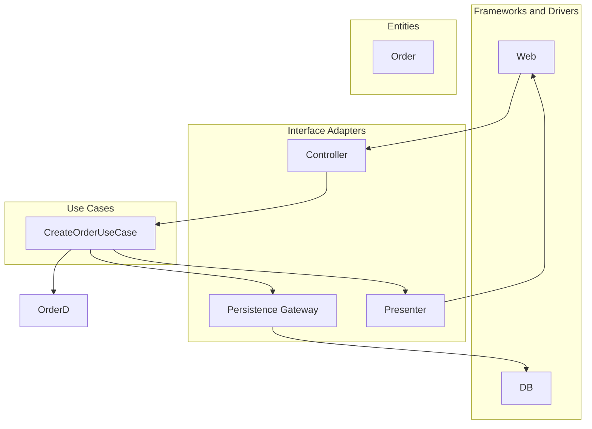

# クリーンアーキテクチャ

## 背景・成り立ち

- **提唱者**: Robert C. Martin（Uncle Bob）
- **時期**: 2012年8月13日、Clean Coder Blog の記事 "The Clean Architecture" で発表
- **経緯**: 当時すでに存在していた複数のアーキテクチャ（BCE、DCI、Hexagonal/Ports and Adapters、Onion、Screaming Architecture など）が「関心の分離」という同じ目的で似た構造を持っていることを観察し、それらを**1つの図とルールに統合**した。フレームワーク・DB・UIに依存しないテスタブルなビジネスルールを目指している。

## 概念の説明

クリーンアーキテクチャは同心円で表される。内側ほど「方針（ポリシー）」、外側ほど「仕組み（メカニズム）」である。

- **Entities**: エンタープライズ全体で共通するビジネスルールを表すオブジェクト
- **Use Cases**: アプリケーション固有のユースケース。エンティティの流れを調整する
- **Interface Adapters**: ユースケース/エンティティのデータ形式と、DB・Web・外部サービスの形式を変換するアダプター（MVC の Presenter/Controller などもここ）
- **Frameworks & Drivers**: DB・Web フレームワーク・ドライバなど。詳細はすべて外側に置く

**依存性のルール**: ソースコードの依存は**内側に向かうだけ**。外側の名前を内側で使ってはならない。境界を跨ぐときは Dependency Inversion Principle（DIP）でインターフェースを内側に定義し、外側が実装する。



境界を跨ぐデータは、単純な DTO やプレーンな構造体にする。DB の Row やフレームワークの型を内側に渡さない。

---

## バックエンドでのコード例（TypeScript/Node）

注文作成ユースケースを、内側（エンティティ・ユースケース・インターフェース）と外側（HTTP・リポジトリ実装）に分けた例。

```typescript
// ========== 内側: エンティティ（ドメインの型） ==========
type Order = {
  id: string;
  userId: string;
  amount: number;
  createdAt: Date;
};

// ========== 内側: ユースケースが依存するポート（インターフェース） ==========
interface OrderRepository {
  save(order: Order): Promise<void>;
  findById(id: string): Promise<Order | null>;
}

// ========== 内側: ユースケース（アプリケーションのビジネスルール） ==========
interface CreateOrderInput {
  userId: string;
  amount: number;
}

class CreateOrderUseCase {
  constructor(private readonly orderRepository: OrderRepository) {}

  async execute(input: CreateOrderInput): Promise<Order> {
    const order: Order = {
      id: crypto.randomUUID(),
      userId: input.userId,
      amount: input.amount,
      createdAt: new Date(),
    };
    await this.orderRepository.save(order);
    return order;
  }
}

// ========== 外側: インフラ（リポジトリの実装） ==========
class InMemoryOrderRepository implements OrderRepository {
  private store = new Map<string, Order>();

  async save(order: Order): Promise<void> {
    this.store.set(order.id, order);
  }

  async findById(id: string): Promise<Order | null> {
    return this.store.get(id) ?? null;
  }
}

// ========== 外側: HTTP アダプター（コントローラ） ==========
import { createServer, IncomingMessage, ServerResponse } from "http";

function createApp(orderRepository: OrderRepository) {
  const useCase = new CreateOrderUseCase(orderRepository);

  return (req: IncomingMessage, res: ServerResponse) => {
    if (req.method === "POST" && req.url === "/orders") {
      let body = "";
      req.on("data", (chunk) => (body += chunk));
      req.on("end", async () => {
        const { userId, amount } = JSON.parse(body) as CreateOrderInput;
        const order = await useCase.execute({ userId, amount });
        res.writeHead(201, { "Content-Type": "application/json" });
        res.end(JSON.stringify(order));
      });
      return;
    }
    res.writeHead(404).end();
  };
}

// 依存性は外側で組み立て（内側はインターフェースだけ知っている）
const repository = new InMemoryOrderRepository();
createServer(createApp(repository)).listen(3000);
```

ユースケースは `OrderRepository` というインターフェースにだけ依存しており、InMemory でも Prisma でも差し替え可能で、テストではモックを注入できる。

---

## フロントエンドでのコード例（React + TypeScript）

フロントでも「内側＝ユースケース/状態の更新ルール」「外側＝UI・API クライアント」に分ける。カスタムフックでユースケースを表現し、API クライアントはインターフェースで注入する。

```typescript
// ========== 内側: ドメインの型 ==========
import React from "react";

type Task = {
  id: string;
  title: string;
  done: boolean;
};

// ========== 内側: ユースケースが依存するポート ==========
interface TaskApi {
  list(): Promise<Task[]>;
  create(title: string): Promise<Task>;
  toggle(id: string): Promise<Task>;
}

// ========== 内側: ユースケース（状態更新のルール） ==========
function useTaskList(api: TaskApi) {
  const [tasks, setTasks] = React.useState<Task[]>([]);
  const [loading, setLoading] = React.useState(false);

  const load = React.useCallback(async () => {
    setLoading(true);
    try {
      const list = await api.list();
      setTasks(list);
    } finally {
      setLoading(false);
    }
  }, [api]);

  const addTask = React.useCallback(
    async (title: string) => {
      const created = await api.create(title);
      setTasks((prev) => [...prev, created]);
    },
    [api]
  );

  const toggleTask = React.useCallback(
    async (id: string) => {
      const updated = await api.toggle(id);
      setTasks((prev) => prev.map((t) => (t.id === id ? updated : t)));
    },
    [api]
  );

  React.useEffect(() => {
    load();
  }, [load]);

  return { tasks, loading, addTask, toggleTask };
}

// ========== 外側: API 実装 ==========
const realTaskApi: TaskApi = {
  async list() {
    const res = await fetch("/api/tasks");
    return res.json();
  },
  async create(title) {
    const res = await fetch("/api/tasks", {
      method: "POST",
      headers: { "Content-Type": "application/json" },
      body: JSON.stringify({ title }),
    });
    return res.json();
  },
  async toggle(id) {
    const res = await fetch(`/api/tasks/${id}/toggle`, { method: "PATCH" });
    return res.json();
  },
};

// ========== 外側: UI（Presentational） ==========
function TaskScreen() {
  const { tasks, loading, addTask, toggleTask } = useTaskList(realTaskApi);

  if (loading) return <p>Loading...</p>;
  return (
    <div>
      <ul>
        {tasks.map((t) => (
          <li key={t.id}>
            <input
              type="checkbox"
              checked={t.done}
              onChange={() => toggleTask(t.id)}
            />
            {t.title}
          </li>
        ))}
      </ul>
      <button onClick={() => addTask("New task")}>Add</button>
    </div>
  );
}
```

`useTaskList` は `TaskApi` にだけ依存しているため、テスト時はフェイクの `TaskApi` を渡せば HTTP なしでユースケースの振る舞いを検証できる。

---

## まとめ

- 依存は内側向きにし、外側の詳細（DB・UI・フレームワーク）に内側が依存しないようにする。
- 境界ではインターフェース（ポート）を内側に定義し、外側で実装（アダプター）を差し替える。
- バックエンド・フロントエンドともに、ユースケースを型とインターフェースで表現し、インフラを注入する形にするとテストしやすくなる。

---

## 参考

- Robert C. Martin, "The Clean Architecture", Clean Coder Blog (2012-08-13). https://blog.cleancoder.com/uncle-bob/2012/08/13/the-clean-architecture.html
- 同上ブログ内で言及されている関連アーキテクチャ: Hexagonal (Alistair Cockburn), Onion (Jeffrey Palermo), DCI (Coplien, Reenskaug) など
