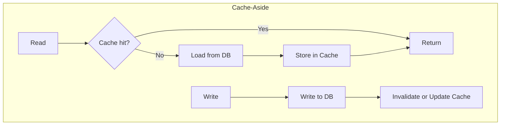

# キャッシュ戦略（Cache-Aside / Write-Through / Write-Behind）

## 背景・成り立ち

- **提唱者**: 単一の「提唱者」は文献では特定しづらい。Microsoft Azure Architecture Center、Hazelcast などのアーキテクチャドキュメントでパターンとして整理されている。業界で広く使われる実践的パターンとして知られている。
- **経緯**: 読み書きの一貫性・レイテンシ・スループットのトレードオフを整理したもの。分散システムやデータベースの前段にキャッシュを置く際の典型的な取り決めとして使われる。

## 概念の説明

| パターン | 読み込み | 書き込み | 一貫性 | 主な用途 |
| -------- | -------- | -------- | ------ | -------- |
| **Cache-Aside** (Lazy Loading) | キャッシュになければ DB から取得し、キャッシュに格納 | アプリが DB に書き、キャッシュは無効化または更新 |  eventual | 読み多め・汎用 |
| **Write-Through** | キャッシュを参照。ミス時は DB から取得してキャッシュに格納 | キャッシュに書き、キャッシュが同期的に DB にも書く | 強い | 読み書きともキャッシュ経由にしたい場合 |
| **Write-Behind** (Write-Back) | 同上 | キャッシュにだけ書き、DB へは非同期で書き込み | 弱い（遅延あり） | 書き込みスループット重視 |



---

## バックエンドでのコード例（TypeScript/Node）

メモリキャッシュ（Map）を使った Cache-Aside と Write-Through の TypeScript 例。

```typescript
// ========== 共通: キャッシュのインターフェース ==========
interface Cache<K, V> {
  get(key: K): V | undefined;
  set(key: K, value: V): void;
  delete(key: K): void;
}

// 簡易メモリキャッシュ
class MapCache<K, V> implements Cache<K, V> {
  private store = new Map<K, V>();
  get(key: K): V | undefined {
    return this.store.get(key);
  }
  set(key: K, value: V): void {
    this.store.set(key, value);
  }
  delete(key: K): void {
    this.store.delete(key);
  }
}

// ========== Cache-Aside（Lazy Loading） ==========
async function cacheAsideGet<T>(
  cache: Cache<string, T>,
  key: string,
  loader: () => Promise<T>
): Promise<T> {
  const cached = cache.get(key);
  if (cached !== undefined) return cached;
  const value = await loader();
  cache.set(key, value);
  return value;
}

async function cacheAsideSet(
  cache: Cache<string, unknown>,
  key: string,
  persist: (value: unknown) => Promise<void>,
  value: unknown
): Promise<void> {
  await persist(value);
  cache.delete(key); // 無効化して次回読みで DB から再取得
}

// ========== Write-Through（キャッシュが DB にも書く） ==========
async function writeThroughSet<T>(
  cache: Cache<string, T>,
  key: string,
  value: T,
  persist: (k: string, v: T) => Promise<void>
): Promise<void> {
  cache.set(key, value);
  await persist(key, value);
}

// 使用例
const cache = new MapCache<string, { id: string; name: string }>();
const db = new Map<string, { id: string; name: string }>();

const user = await cacheAsideGet(cache, "user:1", async () => {
  const row = db.get("user:1");
  if (!row) throw new Error("Not found");
  return row;
});

await writeThroughSet(
  cache,
  "user:1",
  { id: "1", name: "Alice" },
  async (k, v) => {
    db.set(k, v);
  }
);
```

---

## フロントエンドでのコード例（React + TypeScript）

クライアント側キャッシュ（TanStack Query の stale-while-revalidate）を「Cache-Aside に近い」パターンとして、get/update の流れを短く示す。

```typescript
import React from "react";
import { useQuery, useMutation, useQueryClient } from "@tanstack/react-query";

type User = { id: string; name: string };

async function fetchUser(id: string): Promise<User> {
  const res = await fetch(`/api/users/${id}`);
  if (!res.ok) throw new Error("Failed to fetch");
  return res.json();
}

async function updateUser(id: string, name: string): Promise<User> {
  const res = await fetch(`/api/users/${id}`, {
    method: "PATCH",
    headers: { "Content-Type": "application/json" },
    body: JSON.stringify({ name }),
  });
  if (!res.ok) throw new Error("Failed to update");
  return res.json();
}

// Cache-Aside 的: まずキャッシュを見る。stale ならバックグラウンドで再取得
function UserProfile({ userId }: { userId: string }) {
  const queryClient = useQueryClient();

  const { data, isLoading } = useQuery({
    queryKey: ["user", userId],
    queryFn: () => fetchUser(userId),
    staleTime: 60_000,
  });

  const mutation = useMutation({
    mutationFn: ({ name }: { name: string }) => updateUser(userId, name),
    onSuccess: (updated) => {
      // 更新後はキャッシュを上書き（次回表示が一貫）
      queryClient.setQueryData(["user", userId], updated);
    },
  });

  if (isLoading || !data) return <p>Loading...</p>;
  return (
    <div>
      <p>{data.name}</p>
      <button
        onClick={() => mutation.mutate({ name: "New Name" })}
      >
        Update
      </button>
    </div>
  );
}
```

TanStack Query は「キャッシュにあればそれを返し、stale なら裏で再取得する」という Cache-Aside に近い振る舞いを提供する。更新時は API に書き、成功後にキャッシュを更新する形で一貫性を保つ。

---

## まとめ

- Cache-Aside / Write-Through / Write-Behind は、読み書きと一貫性のトレードオフを整理したキャッシュの取り決めである。
- バックエンドでは、Cache-Aside の「読むときはキャッシュ→ミスなら DB→キャッシュに格納」「書くときは DB→キャッシュ無効化」、Write-Through の「書くときはキャッシュと DB を同期」を TypeScript で実装できる。
- フロントでは TanStack Query などが Cache-Aside 的な「stale-while-revalidate」と更新後のキャッシュ更新を提供する。

---

## 参考

- Microsoft Learn, "Cache-Aside pattern", Azure Architecture Center. https://learn.microsoft.com/en-us/azure/architecture/patterns/cache-aside
- Hazelcast, "A Hitchhiker's Guide to Caching Patterns". https://hazelcast.com/blog/a-hitchhikers-guide-to-caching-patterns/
- TanStack Query (React Query) のドキュメント（staleTime, setQueryData 等）
