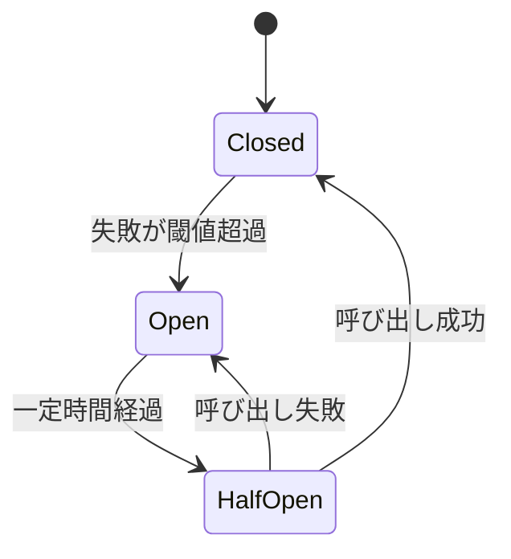

# サーキットブレーカー

## 背景・成り立ち

- **提唱者**: Michael T. Nygard
- **時期**: 2007年、書籍 "Release It!: Design and Deploy Production-Ready Software"（Pragmatic Bookshelf）でパターンとして詳述。第2版は 2018年。Martin Fowler の bliki でも言及されている。
- **経緯**: 本番環境で「一箇所の障害が連鎖して全体が止まる」事態を防ぐため、**障害が閾値を超えたら呼び出しを止め、フォールバックや即時失敗に切り替える**パターンとして整理した。

## 概念の説明

サーキットブレーカーは、外部呼び出し（API・DB）をラップし、失敗が続くと「回路を開く」ことでそれ以上の呼び出しを止める。状態は次の3つで遷移する。

- **Closed**: 通常どおり呼び出しを行う。失敗が閾値（例: 5回連続）を超えると **Open** へ。
- **Open**: 呼び出しを行わず、即座にエラーまたはフォールバックを返す。一定時間後に **Half-Open** へ。
- **Half-Open**: 試験的に 1 回呼び出し、成功すれば **Closed**、失敗すれば **Open** に戻す。



---

## バックエンドでのコード例（TypeScript/Node）

外部 API 呼び出しをラップするサーキットブレーカー。閾値で Open にし、一定時間後に Half-Open で再試行する簡易実装。

```typescript
type State = "Closed" | "Open" | "HalfOpen";

class CircuitBreaker<T, R> {
  private state: State = "Closed";
  private failures = 0;
  private lastFailureTime = 0;

  constructor(
    private readonly call: () => Promise<R>,
    private readonly options: {
      failureThreshold: number;
      resetTimeoutMs: number;
    } = { failureThreshold: 5, resetTimeoutMs: 30_000 }
  ) {}

  async execute(): Promise<R> {
    if (this.state === "Open") {
      if (Date.now() - this.lastFailureTime >= this.options.resetTimeoutMs) {
        this.state = "HalfOpen";
      } else {
        throw new Error("CircuitBreaker is Open");
      }
    }

    try {
      const result = await this.call();
      if (this.state === "HalfOpen") {
        this.state = "Closed";
        this.failures = 0;
      }
      return result;
    } catch (e) {
      this.failures++;
      this.lastFailureTime = Date.now();
      if (this.failures >= this.options.failureThreshold) {
        this.state = "Open";
      }
      throw e;
    }
  }
}

// 使用例: 外部 API をラップ
const fetchWithCircuit = new CircuitBreaker(
  () => fetch("https://api.example.com/data").then((r) => r.json()),
  { failureThreshold: 3, resetTimeoutMs: 10_000 }
);

async function getData() {
  try {
    return await fetchWithCircuit.execute();
  } catch {
    return { fallback: true };
  }
}
```

---

## フロントエンドでのコード例（React + TypeScript）

バックエンド API 呼び出しで「サーキットが開いている」ときの扱い。リトライせず、キャッシュやフォールバック表示をする例。

```typescript
import React from "react";

type ApiState<T> =
  | { status: "loading" }
  | { status: "success"; data: T }
  | { status: "error"; message: string; circuitOpen?: boolean };

// バックエンドが 503 + ヘッダでサーキット開を返す想定
async function fetchWithCircuitAware<T>(url: string): Promise<ApiState<T>> {
  try {
    const res = await fetch(url);
    const circuitOpen = res.headers.get("X-Circuit-Open") === "true";
    if (res.status === 503 || circuitOpen) {
      return {
        status: "error",
        message: "Service temporarily unavailable. Please try again later.",
        circuitOpen: true,
      };
    }
    if (!res.ok) throw new Error(res.statusText);
    const data = await res.json();
    return { status: "success", data };
  } catch (e) {
    return {
      status: "error",
      message: e instanceof Error ? e.message : "Unknown error",
    };
  }
}

function DataScreen() {
  const [state, setState] = React.useState<ApiState<{ items: string[] }>>({
    status: "loading",
  });
  const [cached, setCached] = React.useState<{ items: string[] } | null>(null);

  React.useEffect(() => {
    fetchWithCircuitAware<{ items: string[] }>("/api/items").then((result) => {
      if (result.status === "success") setCached(result.data);
      setState(result);
    });
  }, []);

  if (state.status === "loading") return <p>Loading...</p>;
  if (state.status === "error") {
    return (
      <div>
        <p>{state.message}</p>
        {state.circuitOpen && (
          <p>Retry is paused. We will recover automatically.</p>
        )}
        {cached && (
          <p>Showing cached data from last successful load.</p>
        )}
      </div>
    );
  }
  return <ul>{state.data.items.map((i) => <li key={i}>{i}</li>)}</ul>;
}
```

サーキットが開いているときは無理にリトライせず、メッセージとキャッシュがあればキャッシュ表示に切り替えることで、ユーザー体験と負荷の両方を守る。

---

## まとめ

- サーキットブレーカーは Nygard の "Release It!" で本番の安定性パターンとして広く知られた。
- バックエンドでは、外部呼び出しをラップし、失敗閾値で Open、一定時間後に Half-Open で再試行する実装が典型である。
- フロントエンドでは、503 やヘッダで「サーキット開」を検知し、リトライを控えつつキャッシュやフォールバック表示で対処する。

---

## 参考

- Michael T. Nygard, "Release It!: Design and Deploy Production-Ready Software", Pragmatic Bookshelf (初版 2007, 第2版 2018)
- Martin Fowler, "Circuit Breaker", martinfowler.com (bliki). https://martinfowler.com/bliki/CircuitBreaker.html
