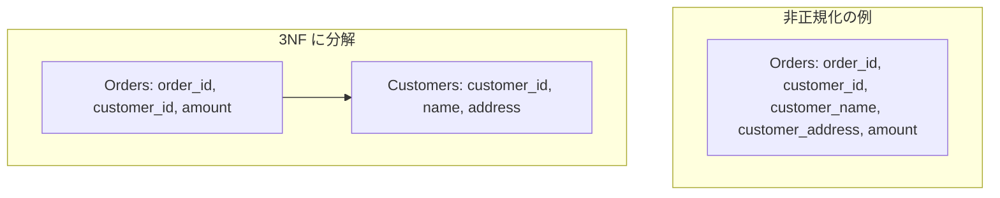

# リレーショナル正規化（3NF 等）

## 背景・成り立ち

- **提唱者**: Edgar F. Codd。3NF は Codd が 1971年 "Further Normalization of the Data Base Relational Model" で定義。リレーショナルモデル自体は 1970年 "A Relational Model of Data for Large Shared Data Banks" で発表。BCNF は 1974年 Raymond F. Boyce と Codd が共同で形式化。
- **経緯**: 大規模共有データバンクのための理論的基盤として、重複と異常（更新・挿入・削除）を減らす正規形を定義した。

## 概念の説明

正規化は、テーブルを分割して**冗長性と更新異常**を減らすための枠組みである。覚え方の一つとして「非キー属性は**キーについて**、**キー全体について**、**キー以外のものについて**言及してはならない」がある。

| 正規形 | 概要 |
| ------ | ---- |
| 1NF | すべての属性が原子値（繰り返しグループなし）である。 |
| 2NF | 1NF かつ、非キー属性が候補キー全体に完全関数従属（部分従属なし）。 |
| 3NF | 2NF かつ、非キー属性が候補キーにのみ従属（推移的従属なし）。 |

非正規化の例: 受注テーブルに「顧客名」「顧客住所」を入れると、同一顧客が複数注文で繰り返し現れ、住所変更時に複数行を更新し忘れる可能性がある。



---

## バックエンドでのコード例（TypeScript + SQL）

正規化前後のスキーマと、そのスキーマを前提にした簡単なクエリ・リポジトリ例。

```sql
-- 正規化前: 受注に顧客名・住所を重複して持つ
-- CREATE TABLE orders_denormalized (
--   order_id TEXT PRIMARY KEY,
--   customer_id TEXT,
--   customer_name TEXT,
--   customer_address TEXT,
--   amount INTEGER
-- );

-- 正規化後（3NF）: 顧客は別テーブルに一度だけ
CREATE TABLE customers (
  customer_id TEXT PRIMARY KEY,
  name TEXT NOT NULL,
  address TEXT
);

CREATE TABLE orders (
  order_id TEXT PRIMARY KEY,
  customer_id TEXT NOT NULL REFERENCES customers(customer_id),
  amount INTEGER NOT NULL
);
```

```typescript
// 正規化されたスキーマを前提にした型とリポジトリ
type Customer = {
  customerId: string;
  name: string;
  address: string | null;
};

type Order = {
  orderId: string;
  customerId: string;
  amount: number;
};

// 一覧取得時は JOIN で結合（バックエンドで実施）
type OrderWithCustomer = Order & {
  customerName: string;
  customerAddress: string | null;
};

interface OrderRepository {
  findById(orderId: string): Promise<Order | null>;
  findWithCustomer(orderId: string): Promise<OrderWithCustomer | null>;
}

// 例: Prisma / pg などで JOIN
async function findWithCustomer(
  orderId: string
): Promise<OrderWithCustomer | null> {
  const row = await db.query(
    `SELECT o.order_id AS "orderId", o.customer_id AS "customerId", o.amount,
            c.name AS "customerName", c.address AS "customerAddress"
     FROM orders o
     JOIN customers c ON o.customer_id = c.customer_id
     WHERE o.order_id = $1`,
    [orderId]
  );
  return row.rows[0] ?? null;
}
```

顧客の住所変更は `customers` の 1 行を更新するだけで、すべての注文表示に反映される。

---

## フロントエンドでのコード例（React + TypeScript）

正規化された API レスポンスを前提に、型定義と表示例。JOIN はバックエンドで行い、フロントは「正規化された DTO」を受け取る形にする。

```typescript
import React from "react";

// バックエンドが正規化された形で返す DTO（注文一覧用に JOIN 済み）
type OrderDto = {
  orderId: string;
  customerId: string;
  amount: number;
  customerName: string;
  customerAddress: string | null;
};

// 別 API で顧客マスタを取得する場合の型（正規化された一覧）
type CustomerDto = {
  customerId: string;
  name: string;
  address: string | null;
};

function OrderList() {
  const [orders, setOrders] = React.useState<OrderDto[]>([]);

  React.useEffect(() => {
    fetch("/api/orders")
      .then((res) => res.json())
      .then((data: OrderDto[]) => setOrders(data));
  }, []);

  return (
    <ul>
      {orders.map((o) => (
        <li key={o.orderId}>
          Order {o.orderId}: ¥{o.amount.toLocaleString()} — {o.customerName}
          {o.customerAddress && ` (${o.customerAddress})`}
        </li>
      ))}
    </ul>
  );
}
```

フロントは「注文＋顧客名・住所」のような**結合済み DTO** を受け取る設計にすることが多い。正規化は DB と API の設計で行い、フロントはその形に合わせた型だけを定義する。

---

## まとめ

- 正規化（1NF〜3NF）は Codd により、重複と更新異常を減らすために定義された。
- バックエンドでは正規化されたテーブルを設計し、必要なときだけ JOIN で結合して DTO を返す。
- フロントエンドでは、その DTO に合わせた型を定義し、正規化されたデータをそのまま表示に使う。

---

## 参考

- E.F. Codd, "A Relational Model of Data for Large Shared Data Banks", Communications of the ACM, Vol.13 No.6 (1970)
- E.F. Codd, "Further Normalization of the Data Base Relational Model", in R. Rustin (ed.), Data Base Systems, Prentice-Hall (1971)
- Third normal form — Wikipedia. https://en.wikipedia.org/wiki/Third_normal_form
