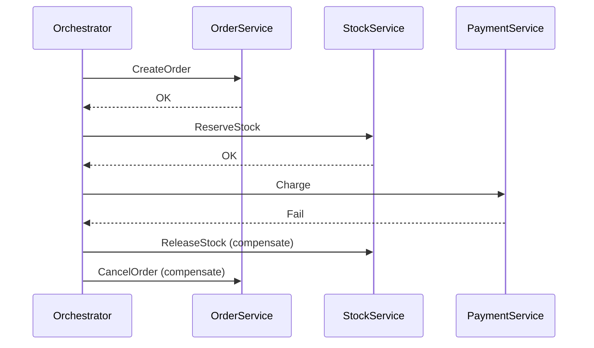

# Saga パターン

## 背景・成り立ち

- **提唱者**: Hector Garcia-Molina と Kenneth Salem
- **時期**: 1987年、ACM SIGMOD で論文 "Sagas" を発表（Princeton University）。
- **経緯**: **長時間トランザクション（LLT）** がロックを長時間保持し、ブロッキング・デッドロック・アボートを増やす問題に対し、長い処理を**複数の小さなトランザクションの列**に分解し、失敗時は**補償トランザクション**で取り消す方式を提案した。マイクロサービス間の分散トランザクションの文脈で再注目されている。

## 概念の説明

Saga は、複数ステップからなる処理を**各ステップを 1 トランザクション**として実行し、どこかで失敗したら**それまでに成功したステップを打ち消す補償トランザクション**を逆順で実行するパターンである。

- **オーケストレーション型**: 中央のオーケストレーターが各ステップを順に呼び出し、失敗時に補償を指示する。
- **コレオグラフィー型**: 各サービスがイベントを発行し、次のサービスが反応する。補償もイベントで伝播する。



---

## バックエンドでのコード例（TypeScript）

オーケストレーション型の例。注文作成 → 在庫確保 → 決済。いずれか失敗時は補償を実行する。

```typescript
type SagaStep<T> = () => Promise<T>;
type Compensate = () => Promise<void>;

class SagaOrchestrator {
  private steps: { run: SagaStep<unknown>; compensate?: Compensate }[] = [];

  step<T>(run: SagaStep<T>, compensate?: Compensate) {
    this.steps.push({ run, compensate });
    return this;
  }

  async execute(): Promise<void> {
    const completed: Compensate[] = [];
    try {
      for (const { run, compensate } of this.steps) {
        await run();
        if (compensate) completed.unshift(compensate);
      }
    } catch (e) {
      for (const comp of completed) {
        await comp();
      }
      throw e;
    }
  }
}

// 注文 Saga の使用例（擬似実装）
const orderId = "ord-1";
const orderRepo = { create: async () => {}, cancel: async () => {} };
const stockRepo = { reserve: async () => {}, release: async () => {} };
const paymentRepo = { charge: async () => {}, refund: async () => {} };

const saga = new SagaOrchestrator()
  .step(
    () => orderRepo.create(orderId),
    () => orderRepo.cancel(orderId)
  )
  .step(
    () => stockRepo.reserve(orderId),
    () => stockRepo.release(orderId)
  )
  .step(
    () => paymentRepo.charge(orderId),
    () => paymentRepo.refund(orderId)
  );

await saga.execute();
```

実際には各ステップで ID や在庫数などを渡し、補償時に同じ ID で取り消す処理を実装する。

---

## フロントエンドでのコード例（React + TypeScript）

Saga が非同期で進むため、フロントは「注文ステータスをポーリングまたは WebSocket で購読する」形になる例。状態（Pending / Completed / Compensating / Failed）の表示と、補償中のメッセージ表示。

```typescript
import React from "react";

type OrderStatus = "Pending" | "Completed" | "Compensating" | "Failed";

type OrderState = {
  orderId: string;
  status: OrderStatus;
  message?: string;
};

function useOrderStatus(orderId: string | null) {
  const [state, setState] = React.useState<OrderState | null>(null);

  React.useEffect(() => {
    if (!orderId) return;
    const interval = setInterval(async () => {
      const res = await fetch(`/api/orders/${orderId}/status`);
      const data = await res.json();
      setState({
        orderId: data.orderId,
        status: data.status,
        message: data.message,
      });
    }, 2000);
    return () => clearInterval(interval);
  }, [orderId]);

  return state;
}

function OrderStatusScreen({ orderId }: { orderId: string }) {
  const order = useOrderStatus(orderId);

  if (!order) return <p>Loading...</p>;

  const statusMessage =
    order.status === "Pending"
      ? "Processing your order..."
      : order.status === "Compensating"
        ? "Something went wrong. Rolling back and refunding..."
        : order.status === "Failed"
          ? order.message ?? "Order failed."
          : "Order completed.";

  return (
    <div>
      <p>Order {order.orderId}</p>
      <p>Status: {order.status}</p>
      <p>{statusMessage}</p>
    </div>
  );
}
```

バックエンドの Saga が Pending → Completed または Pending → Compensating → Failed と遷移するので、フロントはそのステータスをポーリングで取得し、Compensating のときは「ロールバック中」と表示する。

---

## まとめ

- Saga は Garcia-Molina & Salem により、長時間トランザクションを小さなトランザクションの列と補償で扱うパターンとして提案された。
- バックエンドではオーケストレーターが各ステップを順に実行し、失敗時は登録した補償を逆順で実行する。
- フロントエンドでは、Saga の進行に合わせてステータス（Pending / Completed / Compensating / Failed）をポーリングまたは WebSocket で購読し、補償中はその旨を表示する。

---

## 参考

- Hector Garcia-Molina, Kenneth Salem, "Sagas", Proceedings of the 1987 ACM SIGMOD International Conference on Management of Data (1987). ACM DOI: 10.1145/38714.38742
- Dominik Tornow, "Paper Summary: Sagas", Medium. https://dominik-tornow.medium.com/paper-summary-sagas-395ef2a9a575
