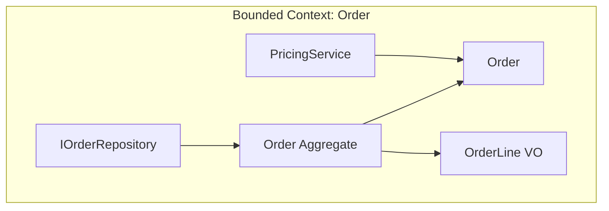

# ドメイン駆動設計（DDD）

## 背景・成り立ち

- **提唱者**: Eric Evans
- **時期**: 2003年、書籍 "Domain-Driven Design: Tackling Complexity in the Heart of Software"（Addison-Wesley）で体系化。原稿は 2003年4月完成。
- **経緯**: 1990年代からオブジェクト指向で大規模業務システムを手がけるなかで、**複雑さをドメインモデルで扱う**必要性を感じ、用語とパターンをまとめた。現在は Domain Language, Inc. でコンサルティング・チーム指導を行っている。

## 概念の説明

DDD では、開発者とドメインの専門家が共有する**ユビキタス言語**をコードに反映し、**境界づけられたコンテキスト**ごとにモデルを分ける。戦術的パターンとして、次のような構成要素がある。

| パターン | 説明 |
| -------- | ---- |
| エンティティ | 同一性（ID）で識別されるオブジェクト。ライフサイクルを通じて同一とみなす。 |
| 値オブジェクト | 同一性を持たず、属性の組み合わせで表現する不変の値。 |
| 集約 | 一貫性の境界となるエンティティのまとまり。集約ルートを経由してのみ変更する。 |
| リポジトリ | 集約の永続化・再構成のインターフェース。コレクションのように扱う。 |
| ドメインサービス | 単一のエンティティに属さないドメインの振る舞い。 |



---

## バックエンドでのコード例（TypeScript）

集約（Order + OrderLine）、値オブジェクト（Money, ProductId）、リポジトリインターフェースとアプリケーションサービスを短く示す。

```typescript
// ========== 値オブジェクト（不変・同一性なし） ==========
class Money {
  constructor(
    public readonly amount: number,
    public readonly currency: string
  ) {}

  add(other: Money): Money {
    if (this.currency !== other.currency) throw new Error("Currency mismatch");
    return new Money(this.amount + other.amount, this.currency);
  }
}

type ProductId = string & { readonly __brand: unique symbol };
function createProductId(id: string): ProductId {
  return id as ProductId;
}

// ========== 集約ルート: Order ==========
class OrderLine {
  constructor(
    public readonly productId: ProductId,
    public readonly quantity: number,
    public readonly unitPrice: Money
  ) {}

  get total(): Money {
    return new Money(this.unitPrice.amount * this.quantity, this.unitPrice.currency);
  }
}

class Order {
  private constructor(
    public readonly id: string,
    public lines: OrderLine[],
    public status: "Draft" | "Submitted"
  ) {}

  static create(id: string): Order {
    return new Order(id, [], "Draft");
  }

  addLine(productId: ProductId, quantity: number, unitPrice: Money): void {
    if (this.status !== "Draft") throw new Error("Cannot modify submitted order");
    this.lines.push(new OrderLine(productId, quantity, unitPrice));
  }

  total(): Money {
    return this.lines.reduce(
      (acc, line) => acc.add(line.total),
      new Money(0, "JPY")
    );
  }
}

// ========== リポジトリ（集約の永続化） ==========
interface IOrderRepository {
  findById(id: string): Promise<Order | null>;
  save(order: Order): Promise<void>;
}

// ========== アプリケーションサービス（ユースケース） ==========
class AddOrderLineService {
  constructor(private readonly orderRepository: IOrderRepository) {}

  async execute(
    orderId: string,
    productId: string,
    quantity: number,
    unitPriceCents: number
  ): Promise<void> {
    const order = await this.orderRepository.findById(orderId);
    if (!order) throw new Error("Order not found");
    order.addLine(createProductId(productId), quantity, new Money(unitPriceCents, "JPY"));
    await this.orderRepository.save(order);
  }
}
```

エンティティは `Order`（ID で識別）、値オブジェクトは `Money`・`ProductId`・`OrderLine`。集約の変更は `Order` を経由して行い、リポジトリは集約単位で保存・取得する。

---

## フロントエンドでのコード例（React + TypeScript）

ドメインを「表示用 DTO」と分離し、ユビキタス言語に近い型をフロントでも使う例。注文状態の判定をドメインオブジェクトに寄せる。

```typescript
import React from "react";

// ========== ドメインの型（ユビキタス言語に合わせる） ==========
type OrderStatus = "Draft" | "Submitted" | "Shipped";

type Order = {
  id: string;
  status: OrderStatus;
  lines: { productId: string; productName: string; quantity: number; unitPrice: number }[];
};

// ドメインのルールをフロントでも共有（状態の判定）
function canEditOrder(order: Order): boolean {
  return order.status === "Draft";
}

function orderTotal(order: Order): number {
  return order.lines.reduce((sum, l) => sum + l.quantity * l.unitPrice, 0);
}

// ========== 表示用コンポーネント ==========
function OrderDetail({ order }: { order: Order }) {
  const editable = canEditOrder(order);

  return (
    <div>
      <p>Status: {order.status}</p>
      <p>Total: ¥{orderTotal(order).toLocaleString()}</p>
      <ul>
        {order.lines.map((line, i) => (
          <li key={i}>
            {line.productName} x {line.quantity} = ¥
            {(line.quantity * line.unitPrice).toLocaleString()}
          </li>
        ))}
      </ul>
      {editable && <button>Edit</button>}
    </div>
  );
}

// API から取得した DTO を Order 型にマッピングしてから渡す
function OrderScreen({ orderId }: { orderId: string }) {
  const [order, setOrder] = React.useState<Order | null>(null);

  React.useEffect(() => {
    fetch(`/api/orders/${orderId}`)
      .then((res) => res.json())
      .then((dto: Order) => setOrder(dto));
  }, [orderId]);

  if (!order) return <p>Loading...</p>;
  return <OrderDetail order={order} />;
}
```

`canEditOrder` と `orderTotal` をドメインのルールとして型と一緒に置くことで、表示と「編集可能か」「合計はいくつか」の判断が一貫する。API の DTO が `Order` と同じ形であればそのまま使え、違う場合はマッピング層で `Order` に変換する。

---

## まとめ

- DDD はユビキタス言語と境界づけられたコンテキストで複雑なドメインを整理する。
- 戦術的には、エンティティ・値オブジェクト・集約・リポジトリ・ドメインサービスを組み合わせてモデルを表現する。
- バックエンドでは集約と値オブジェクトで一貫性の境界を明確にし、フロントエンドでは同じ用語とルール（状態判定・計算）を型と関数で共有すると、一貫した振る舞いを保ちやすい。

---

## 参考

- Eric Evans, "Domain-Driven Design: Tackling Complexity in the Heart of Software", Addison-Wesley (2003)
- Domain Language, Inc. / DDD Community. https://www.dddcommunity.org/
