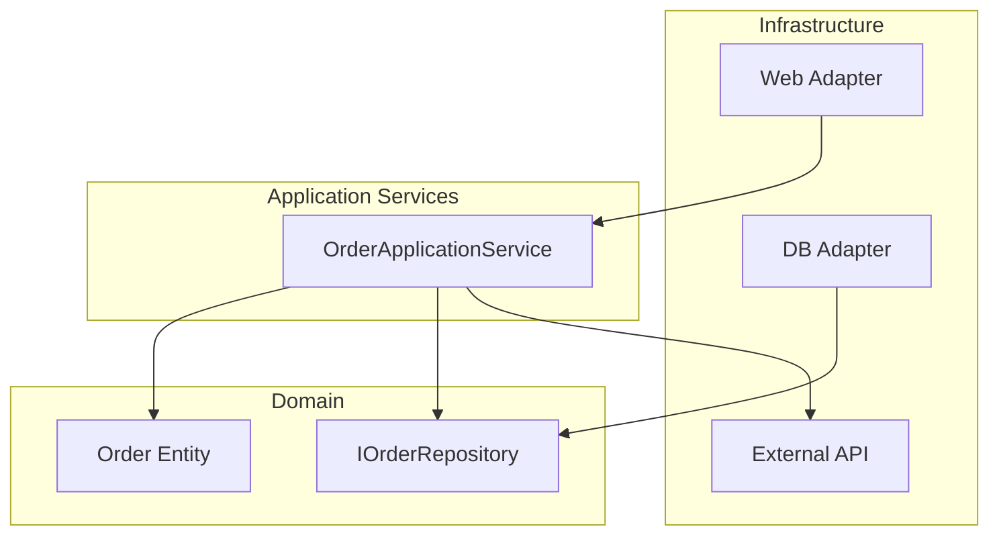

# オニオンアーキテクチャ

## 背景・成り立ち

- **提唱者**: Jeffrey Palermo
- **時期**: 2008年7月、ブログ "The Onion Architecture : part 1" で発表（part 2 も同年）
- **経緯**: 従来のレイヤードアーキテクチャで、UI・ビジネスロジック・データアクセスが密結合になる問題に対処するために提唱した。**「すべての結合は中心に向かう」** という原則で、ドメインモデルを中心に据え、インフラを外側に追い出す。DDD・CQRS・TDD と組み合わせて言及されることが多い。

## 概念の説明

オニオンアーキテクチャでは、中心に**ドメインモデル**を置く。その外側にドメインサービス／アプリケーションサービス、さらに外側にインフラ（DB、UI、外部 API）が並ぶ。内側がインターフェースを定義し、外側が実装する点は、クリーンアーキテクチャやヘキサゴナルと同様である。



- **中心（コア）**: ドメインエンティティとドメインのルール。フレームワーク・DB・UI に一切依存しない。
- **その外側**: リポジトリや外部サービスの**インターフェース**（ポート）。実装は持たない。
- **最外層**: 上記インターフェースの**実装**（アダプター）。ORM・HTTP クライアント・コントローラなど。

---

## バックエンドでのコード例（TypeScript/Node）

ドメインエンティティを中心に、リポジトリインターフェースを内側、実装とコントローラを外側に置く例。

```typescript
// ========== 中心: ドメインモデル（何にも依存しない） ==========
class Task {
  constructor(
    public readonly id: string,
    public title: string,
    public done: boolean
  ) {}

  toggle(): Task {
    return new Task(this.id, this.title, !this.done);
  }
}

// ========== 内側: ドメインが使うポート（インターフェース） ==========
interface ITaskRepository {
  findById(id: string): Promise<Task | null>;
  save(task: Task): Promise<void>;
}

// ========== アプリケーションサービス（ユースケースのオーケストレーション） ==========
class ToggleTaskService {
  constructor(private readonly taskRepository: ITaskRepository) {}

  async execute(taskId: string): Promise<Task> {
    const task = await this.taskRepository.findById(taskId);
    if (!task) throw new Error("Task not found");
    const updated = task.toggle();
    await this.taskRepository.save(updated);
    return updated;
  }
}

// ========== 外側: インフラ（リポジトリ実装） ==========
class InMemoryTaskRepository implements ITaskRepository {
  private store = new Map<string, Task>();

  async findById(id: string): Promise<Task | null> {
    return this.store.get(id) ?? null;
  }

  async save(task: Task): Promise<void> {
    this.store.set(task.id, task);
  }
}

// ========== 外側: HTTP アダプター ==========
import { createServer, IncomingMessage, ServerResponse } from "http";

function handleToggle(
  req: IncomingMessage,
  res: ServerResponse,
  service: ToggleTaskService
) {
  const id = req.url?.split("/")[2];
  if (!id) {
    res.writeHead(400).end();
    return;
  }
  service
    .execute(id)
    .then((task) => {
      res.writeHead(200, { "Content-Type": "application/json" });
      res.end(JSON.stringify(task));
    })
    .catch(() => res.writeHead(404).end());
}

// 組み立て: 外側が内側のインターフェースを実装し、サービスに注入
const taskRepository: ITaskRepository = new InMemoryTaskRepository();
const toggleService = new ToggleTaskService(taskRepository);
createServer((req, res) => {
  if (req.method === "PATCH" && req.url?.startsWith("/tasks/"))
    handleToggle(req, res, toggleService);
  else res.writeHead(404).end();
}).listen(3000);
```

ドメインの `Task` は純粋な型と振る舞いだけを持ち、`ITaskRepository` は中心に近い層で定義され、実装は外側の `InMemoryTaskRepository` に閉じている。

---

## フロントエンドでのコード例（React + TypeScript）

フロントでも「中心＝ドメイン（タスクのルール）」と「外側＝ストレージ・API アダプター」に分ける。ストレージを差し替え可能にする。

```typescript
import React from "react";

// ========== 中心: ドメインモデル ==========
type Task = {
  id: string;
  title: string;
  done: boolean;
};

function toggleTask(task: Task): Task {
  return { ...task, done: !task.done };
}

// ========== 内側: 永続化のポート ==========
interface TaskStorage {
  getAll(): Promise<Task[]>;
  save(task: Task): Promise<void>;
}

// ========== アプリケーションのユースケース（ストレージに依存） ==========
function useTasks(storage: TaskStorage) {
  const [tasks, setTasks] = React.useState<Task[]>([]);

  const load = React.useCallback(async () => {
    const list = await storage.getAll();
    setTasks(list);
  }, [storage]);

  const toggle = React.useCallback(
    async (task: Task) => {
      const updated = toggleTask(task);
      await storage.save(updated);
      setTasks((prev) => prev.map((t) => (t.id === task.id ? updated : t)));
    },
    [storage]
  );

  React.useEffect(() => {
    load();
  }, [load]);

  return { tasks, toggle };
}

// ========== 外側: ローカルストレージアダプター ==========
const localStorageTaskStorage: TaskStorage = {
  async getAll() {
    const raw = localStorage.getItem("tasks");
    return raw ? JSON.parse(raw) : [];
  },
  async save(task) {
    const raw = localStorage.getItem("tasks");
    const list: Task[] = raw ? JSON.parse(raw) : [];
    const next = list.map((t) => (t.id === task.id ? task : t));
    if (!list.some((t) => t.id === task.id)) next.push(task);
    localStorage.setItem("tasks", JSON.stringify(next));
  },
};

// ========== 外側: API アダプター（差し替え可能） ==========
const apiTaskStorage: TaskStorage = {
  async getAll() {
    const res = await fetch("/api/tasks");
    return res.json();
  },
  async save(task) {
    await fetch(`/api/tasks/${task.id}`, {
      method: "PUT",
      headers: { "Content-Type": "application/json" },
      body: JSON.stringify(task),
    });
  },
};

// UI: どちらのストレージでも同じフックが使える
function TaskList() {
  const { tasks, toggle } = useTasks(apiTaskStorage);
  return (
    <ul>
      {tasks.map((t) => (
        <li key={t.id}>
          <input
            type="checkbox"
            checked={t.done}
            onChange={() => toggle(t)}
          />
          {t.title}
        </li>
      ))}
    </ul>
  );
}
```

ドメインの `Task` と `toggleTask` は UI やストレージに依存しておらず、`TaskStorage` の実装をローカルストレージから API に差し替えても中心のロジックはそのまま使える。

---

## まとめ

- オニオンアーキテクチャは、ドメインモデルを中心に据え、すべての結合を中心に向ける。
- 内側でインターフェースを定義し、外側で実装するため、クリーンアーキテクチャ・ヘキサゴナルと親和性が高い。
- バックエンド・フロントエンドとも、ドメインを「何にも依存しない層」に置き、永続化や HTTP はアダプターとして外側に実装すると、テスタビリティと差し替えがしやすくなる。

---

## 参考

- Jeffrey Palermo, "The Onion Architecture : part 1", Programming with Palermo (2008-07). https://jeffreypalermo.com/2008/07/the-onion-architecture-part-1/
- Jeffrey Palermo, "The Onion Architecture : part 2", Programming with Palermo (2008-07). https://jeffreypalermo.com/2008/07/the-onion-architecture-part-2/
